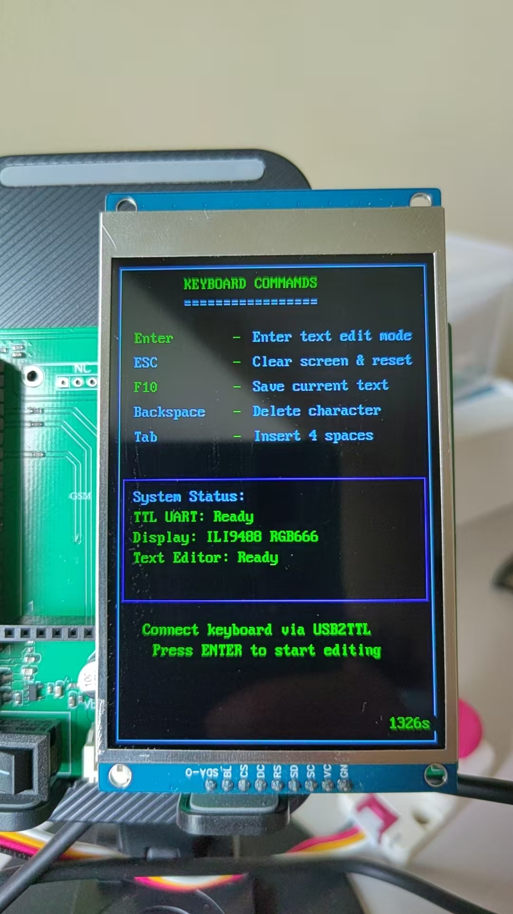

# USB2TTL Pico Keyboard System


English | [中文](README.zh.md)

## Project Overview

This is a TTL keyboard input system based on Raspberry Pi Pico that receives keyboard input through a USB2TTL module and provides text editing functionality on an ILI9488 3.5-inch TFT display.
<p align="center">
  
</p>
### Core Features
- **Pure Serial Communication**: Completely based on UART communication, independent of USB protocol
- **Dual-Mode Interface**: Command mode and text editing mode
- **Smart Key Filtering**: 200ms duplicate key filtering, effectively handles USB2TTL module repeat transmissions
- **Modern C++**: Uses C++17 features with complete object-oriented design
- **RGB666 Display**: Native support for ILI9488's RGB666 color system

### Version Information
- **Version**: 2.1.0
- **Hardware**: Raspberry Pi Pico + ILI9488 + USB2TTL Module
- **Development Language**: C++17
- **Memory Usage**: FLASH 782KB (17.8%), RAM 15KB (5.8%)

## Hardware Connections

### Signal Flow
```
Keyboard → USB2TTL Module → UART1 Serial → Raspberry Pi Pico → ILI9488 Display
         (USB to Serial)   (GPIO 8/9)                        (SPI Interface)
```

### TTL Keyboard Connection (UART1)
```
USB2TTL Module    →    Raspberry Pi Pico
TX                →    GPIO 9 (RX)
RX                →    GPIO 8 (TX)  
GND               →    GND
VCC               →    3.3V (Optional)
```

**Important Notes**:
- Baud Rate: **115200**
- Data Bits: 8 bits, Stop Bits: 1 bit, No Parity
- TX/RX cross-connection ensures proper communication

### ILI9488 Display Connection (SPI0)
```
ILI9488 Pin       →    Raspberry Pi Pico Pin
CS                →    GPIO 17
DC                →    GPIO 20
RST               →    GPIO 15
SCK               →    GPIO 18
MOSI              →    GPIO 19
BL                →    GPIO 10 (Backlight)
VCC               →    3.3V
GND               →    GND
```

### Debug Output (Optional)
```
GPIO 0 (TX)       →    USB2TTL Module (115200 baud rate)
```

## Software Architecture

### Core Class Design

#### 1. TTLKeyboard (`include/ttl_keyboard.hpp`)
- **Function**: Handles UART1 serial communication and key parsing
- **Features**: 
  - Smart duplicate key filtering (200ms threshold)
  - Noise data filtering (0xFF/0x00 bytes)
  - Connection status detection (5-second timeout)
  - Complete key mapping table

#### 2. TextEditor (`include/text_editor.hpp`)
- **Function**: Text editing and display management
- **Features**:
  - 38 characters/line, 80 lines capacity (3040 characters total)
  - Smart auto-wrap
  - Partial refresh to reduce flicker
  - Input freeze protection

#### 3. ILI9488DisplayAdapter (`examples/usb2ttl_demo.cpp`)
- **Function**: Display driver adapter
- **Features**:
  - RGB666 native color support
  - Optimized graphics rendering
  - Smart color conversion

### Application State Management
- **COMMAND_MODE**: Keyboard command interface
- **EDIT_MODE**: Text editing mode

## Usage Instructions

### Quick Start

1. **Hardware Connection**: Connect all hardware according to the connection diagram above
2. **Flash Firmware**: Drag `usb2ttl_demo.uf2` to Pico's USB drive
3. **Connect Keyboard**: Connect keyboard to USB2TTL module
4. **Start Using**: System displays command interface after startup

### Operation Guide

#### Command Mode
| Key | Function |
|-----|----------|
| Enter | Enter text editing mode |
| ESC | Refresh command interface |

#### Edit Mode
| Key | Function |
|-----|----------|
| ESC | Return to command mode |
| Enter | New line |
| Backspace | Delete character |
| Tab | Insert tab |
| Letters/Numbers/Symbols | Input character |

### Status Display

Real-time display at bottom of screen:
- **TTL-KB**: Keyboard connection status (Connected/Waiting...)
- **Mode**: Current mode (COMMAND/EDIT)
- **Runtime**: System runtime
- **Cursor Position**: L:line C:column (edit mode)
- **Line Count**: Current lines/Maximum lines

## Build Instructions

### Environment Requirements
- **Pico SDK**: v1.5.1+
- **CMake**: 3.13+
- **Compiler**: GCC ARM toolchain
- **Operating System**: Windows/Linux/macOS

### Build Steps
```bash
# Create build directory
mkdir build && cd build

# Configure project
cmake ..

# Compile (Windows uses ninja)
ninja

# Or use make on Linux/macOS
make -j4
```

### Output Files
- `usb2ttl_demo.uf2` (782KB) - Main program
- `debug_uart.uf2` (68KB) - UART debug tool
- `test_uart.uf2` (66KB) - UART test program

## Technical Features

### Communication Protocol
- **UART Instance**: UART1
- **GPIO Configuration**: TX=8, RX=9
- **Baud Rate**: 115200 bps
- **Data Format**: 8N1 (8 data bits, no parity, 1 stop bit)

### Key Processing
- **Duplicate Key Filtering**: 200ms threshold, effectively filters USB2TTL repeat transmissions
- **Noise Filtering**: Automatically filters 0xFF/0x00 noise bytes
- **Connection Detection**: 5-second timeout mechanism based on valid data
- **Supported Keys**: ASCII characters, control keys, function keys

### Display System
- **Color Format**: RGB666 (18-bit, 262,144 colors)
- **Resolution**: 320x480 pixels
- **Font**: 8x16 pixel bitmap font
- **Refresh Strategy**: Partial refresh optimization

### Memory Optimization
- **FLASH Usage**: 782KB / 2MB (38.2%)
- **RAM Usage**: 15KB / 264KB (5.8%)
- **Buffer Management**: Smart buffer reuse
- **Color Conversion**: Zero-copy optimization

## Troubleshooting

### Common Issues

#### 1. Keyboard Not Responding
**Symptoms**: Display shows "TTL-KB: Waiting..."
**Solutions**:
1. Check USB2TTL module connection
2. Confirm baud rate is set to 115200
3. Verify TX/RX cross-connection
4. Check keyboard to USB2TTL connection

#### 2. Duplicate Character Input
**Symptoms**: Pressing one key produces multiple identical characters
**Solutions**:
- Resolved through 200ms duplicate key filtering
- If issues persist, adjust `DUPLICATE_KEY_THRESHOLD` value

#### 3. Display Not Working
**Symptoms**: Black screen or corrupted display
**Solutions**:
1. Check SPI connection wires
2. Ensure stable power supply
3. Check backlight connection (GPIO 10)
4. Verify ILI9488 model compatibility

#### 4. Compilation Errors
**Common errors and solutions**:
```bash
# Pico SDK path issue
export PICO_SDK_PATH=/path/to/pico-sdk

# Clean build cache
rm -rf build && mkdir build

# Check CMake version
cmake --version  # Requires >= 3.13
```

### Debug Tools

#### Using debug_uart.uf2
1. Flash debug program to Pico
2. Connect debug serial port (GPIO 0, 115200 baud rate)
3. Observe detailed data reception logs
4. Analyze key mapping and timing intervals

#### Debug Output Example
```
--- TTL Keyboard received data (Time: 91418 ms) ---
Byte count: 1
Hex data (1 byte): 65 
ASCII representation: e
Special character analysis:
  [0] Printable character 'e'
Valid data detected, proceeding with key parsing
Parsed key: e
--- TTL Keyboard data processing complete ---
```

## Development Guide

### Adding New Features

#### Extending Key Support
```cpp
// Add in ttl_keyboard.cpp's init_key_map()
key_map_[0xSpecificByte] = "NewKeyName";
```

#### Modifying Text Editor
```cpp
// Extend functionality in text_editor.cpp
void TextEditor::new_feature() {
    // Implement new feature
}
```

### Code Standards
- Use 4-space indentation
- Functions and variables use snake_case naming
- Class names use PascalCase naming
- Complete Doxygen documentation comments

### Commit Standards
```bash
git commit -m "feat: add new feature description"
git commit -m "fix: fix specific issue"
git commit -m "docs: update documentation content"
```

## License

This project is licensed under the MIT License. See [LICENSE](LICENSE) file for details.

## Changelog

### v2.1.0 (Current Version)
- ✅ Optimized duplicate key filtering to 200ms threshold
- ✅ Fixed text editor content retention issue
- ✅ Corrected row-column coordinate system parameter order
- ✅ Unified baud rate to 115200
- ✅ Cleaned up compilation warnings and unused variables

### v2.0.0
- 🔄 Refactored to TTL keyboard input system
- ❌ Removed USB HID dependency
- ✅ Simplified to dual-mode interface
- ✅ Optimized RGB666 color system
- ✅ Improved error handling and status display

### v1.0.0
- 🎉 Initial version release
- ✅ Basic USB keyboard functionality
- ✅ ILI9488 display support

## Contributing

Contributions of any kind are welcome! Please refer to [CONTRIBUTING.md](CONTRIBUTING.md) for detailed contribution guidelines.

### Ways to Contribute
- 🐛 Report Bugs
- 💡 Suggest New Features  
- 📝 Improve Documentation
- 🔧 Submit Code

---

**Project Repository**: [GitHub Repository]
**Technical Support**: Please submit issues through GitHub Issues
**Developers**: USB2TTL Pico Team 