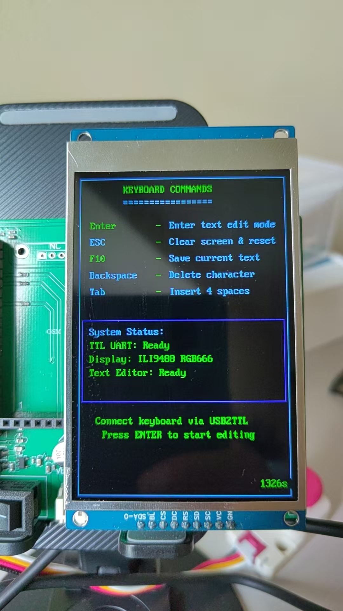

# USB2TTL Pico 键盘系统


[English](README.md) | 中文

## 项目概述

这是一个基于树莓派Pico的TTL键盘输入系统，通过USB2TTL模块接收键盘输入，并在显示屏上提供文本编辑功能。系统现在支持ILI9488 TFT显示屏和ST7306反射式LCD显示屏。

<p align="center">
  
</p>

### 核心特性
- **纯串口通信**: 完全基于UART通信，与USB协议无关
- **双显示屏支持**: 兼容ILI9488 TFT和ST7306反射式LCD
- **双模式界面**: 命令模式和文本编辑模式
- **智能按键过滤**: 200ms重复按键过滤，有效处理USB2TTL模块重复发送
- **现代C++**: 使用C++17特性，完整的面向对象设计
- **自适应颜色系统**: ILI9488支持RGB666，ST7306支持4级灰度

### 版本信息
- **版本**: 2.1.0
- **硬件**: Raspberry Pi Pico + 显示屏 + USB2TTL模块
- **支持的显示屏**: 
  - ILI9488 3.5英寸TFT (320x480, RGB666)
  - ST7306 4.2英寸反射式LCD (300x400, 4级灰度)
- **开发语言**: C++17
- **内存使用**: FLASH 783KB (17.9%), RAM 15KB (5.8%)

## 硬件连接

### 信号流程
```
键盘 → USB2TTL模块 → UART1串口 → 树莓派Pico → 显示屏
     (USB转串口)    (GPIO 8/9)              (SPI接口)
```

### TTL键盘连接 (UART0)
```
USB2TTL模块    →    树莓派Pico引脚
TX             →    GPIO 1 (RX)
RX             →    GPIO 0 (TX)  
GND            →    GND
VCC            →    3.3V~5.0V
```

**重要说明**:
- 波特率: **115200**
- 数据位: 8位，停止位: 1位，无校验
- TX/RX交叉连接确保正确通信

### 统一SPI显示接口连接 (SPI0)
```
显示屏引脚     →    树莓派Pico引脚    →    功能说明
CS             →    GPIO 17          →    片选信号
DC             →    GPIO 20          →    数据/命令选择
RST            →    GPIO 15          →    重置信号
SCL/SCK        →    GPIO 18          →    时钟线
SDA/MOSI       →    GPIO 19          →    数据线
BL             →    GPIO 16          →    背光控制 (仅ILI9488)
TE             →    GPIO 21          →    撕裂效应信号 (仅st73xx系列，保留)
VCC            →    3.3V             →    电源正极
GND            →    GND              →    电源负极
```

### ILI9488显示屏特性
```
- 分辨率: 320x480像素
- 颜色: RGB666 (262,144色)
- 背光控制: GPIO16 (PWM调节)
- 功耗: 中等 (需要背光)
```

### ST7306显示屏特性
```
- 分辨率: 300x400像素  
- 颜色: 4级灰度
- 背光控制: 无需背光 (反射式LCD)
- 功耗: 超低功耗
```

**ST7306特性**:
- **分辨率**: 300x400像素
- **显示类型**: 反射式LCD (无需背光)
- **颜色深度**: 4级灰度 (每像素2位)
- **功耗**: 超低功耗，支持睡眠模式

### 调试输出 (可选)
```
GPIO 0 (TX)    →    USB2TTL模块 (115200波特率)
```

## 软件架构

### 核心类设计

#### 1. TTLKeyboard (`include/ttl_keyboard.hpp`)
- **功能**: 处理UART0串口通信和按键解析
- **特性**: 
  - 智能重复按键过滤 (200ms阈值)
  - 噪声数据过滤 (0xFF/0x00字节)
  - 连接状态检测 (5秒超时)
  - 完整的按键映射表

#### 2. TextEditor (`include/text_editor.hpp`)
- **功能**: 文本编辑和显示管理
- **特性**:
  - 适应不同屏幕尺寸的自适应布局
  - 智能自动换行
  - 局部刷新减少闪烁
  - 输入冻结保护

#### 3. 显示适配器
- **ILI9488DisplayAdapter**: RGB666颜色支持，背光控制
- **ST7306DisplayAdapter**: 4级灰度，功耗模式控制

### 应用状态管理
- **COMMAND_MODE**: 键盘命令界面
- **EDIT_MODE**: 文本编辑模式

## 使用说明

### 快速开始

1. **硬件连接**: 按照上述连接图连接所有硬件
2. **烧录固件**: 将`usb2ttl_demo.uf2`拖拽到Pico的USB驱动器
3. **连接键盘**: 将键盘连接到USB2TTL模块
4. **开始使用**: 系统启动后显示命令界面

### 操作指南

#### 命令模式
| 按键 | 功能 |
|------|------|
| Enter | 进入文本编辑模式 |
| ESC | 刷新命令界面 |

#### 编辑模式
| 按键 | 功能 |
|------|------|
| ESC | 返回命令模式 |
| Enter | 换行 |
| Backspace | 删除字符 |
| Tab | 插入制表符 |
| 字母/数字/符号 | 输入字符 |

### 状态显示

屏幕底部实时显示：
- **TTL-KB**: 键盘连接状态 (Connected/Waiting...)
- **模式**: 当前模式 (COMMAND/EDIT)
- **运行时间**: 系统运行时间
- **光标位置**: L:行 C:列 (编辑模式)
- **行数统计**: 当前行数/最大行数

## 构建说明

### 环境要求
- **Pico SDK**: v1.5.1+
- **CMake**: 3.13+
- **编译器**: GCC ARM工具链
- **操作系统**: Windows/Linux/macOS

### 构建步骤
```bash
# 创建构建目录
mkdir build && cd build

# 配置项目
cmake ..

# 编译 (Windows使用ninja)
ninja

# 或在Linux/macOS使用make
make -j4
```

### 输出文件
- `usb2ttl_demo.uf2` (785KB) - ILI9488主程序
- `usb2ttl_demo_st7306.uf2` (783KB) - ST7306主程序
- `st7306_test.uf2` (734KB) - ST7306显示测试程序
- `debug_uart.uf2` (78KB) - UART调试工具

## 技术特性

### 通信协议
- **UART实例**: UART0 (固定硬件配置)
- **GPIO配置**: TX=0, RX=1
- **波特率**: 115200 bps
- **数据格式**: 8N1 (8数据位，无校验，1停止位)

### 按键处理
- **重复按键过滤**: 200ms阈值，有效过滤USB2TTL重复发送
- **噪声过滤**: 自动过滤0xFF/0x00噪声字节
- **连接检测**: 基于有效数据的5秒超时机制
- **支持按键**: ASCII字符、控制键、功能键

### 显示系统

#### ILI9488 TFT显示屏
- **颜色格式**: RGB666 (18位，262,144色)
- **分辨率**: 320x480像素
- **特性**: 背光控制，高色彩精度
- **文本布局**: 40字符/行，30行

#### ST7306反射式LCD
- **颜色格式**: 4级灰度 (每像素2位)
- **分辨率**: 300x400像素
- **特性**: 无需背光，超低功耗
- **文本布局**: 37字符/行，25行
- **功耗模式**: 高性能/低功耗模式

### 内存优化
- **FLASH使用**: 783KB / 2MB (38.3%)
- **RAM使用**: 15KB / 264KB (5.8%)
- **缓冲区管理**: 智能缓冲区复用
- **颜色转换**: ST7306优化的灰度映射

## 显示屏特性对比

### ST7306优势
- **节能高效**: 反射式显示无需背光
- **阳光可读**: 在强光环境下具有优秀的可视性
- **低功耗**: 支持睡眠模式，适合电池供电应用
- **护眼舒适**: 无蓝光发射，适合长时间阅读

### ILI9488优势
- **丰富色彩**: 完整的RGB666颜色支持
- **高亮度**: 可调节背光适应各种光照条件
- **快速刷新**: 针对动态内容显示优化

## 故障排除

### 常见问题

#### 1. 键盘无响应
**症状**: 显示"TTL-KB: Waiting..."
**解决方案**:
1. 检查USB2TTL模块连接
2. 确认波特率设置为115200
3. 验证TX/RX交叉连接
4. 检查键盘到USB2TTL的连接

#### 2. ST7306显示问题
**症状**: 屏幕空白或显示错误
**解决方案**:
1. 验证SPI连接线 (无需背光引脚)
2. 检查电源供应稳定性
3. 确保使用正确固件 (`usb2ttl_demo_st7306.uf2`)
4. 使用 `st7306_test.uf2` 进行硬件验证

#### 3. 文本布局问题
**症状**: 文本显示被截断或错位
**解决方案**:
- 使用与显示屏类型匹配的正确固件
- ST7306: 37字符/行，25行
- ILI9488: 40字符/行，30行

## 更新日志

### v2.1.0 (当前版本)
- ✅ 添加ST7306反射式LCD支持
- ✅ 实现不同屏幕尺寸的自适应布局
- ✅ 添加ST7306测试程序，包含7项综合测试
- ✅ 优化重复按键过滤为200ms阈值
- ✅ 修复文本编辑器内容保留问题
- ✅ 修正行列坐标系统参数顺序
- ✅ 统一波特率为115200
- ✅ 清理编译警告和未使用变量

### v2.0.0
- 🔄 重构为TTL键盘输入系统
- ❌ 移除USB HID依赖
- ✅ 简化为双模式界面
- ✅ 优化RGB666颜色系统
- ✅ 改进错误处理和状态显示

### v1.0.0
- 🎉 初始版本发布
- ✅ 基础USB键盘功能
- ✅ ILI9488显示支持

## 贡献

欢迎任何形式的贡献！请参考[CONTRIBUTING.md](CONTRIBUTING.md)了解详细的贡献指南。

### 贡献方式
- 🐛 报告Bug
- 💡 提出新功能建议  
- 📝 改进文档
- 🔧 提交代码

---

**项目地址**: [GitHub Repository]
**技术支持**: 请通过Issues提交问题
**开发者**: USB2TTL Pico Team 